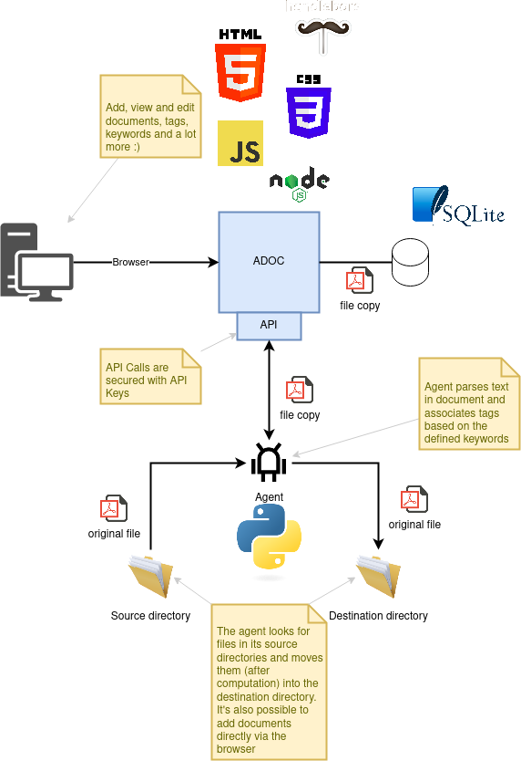
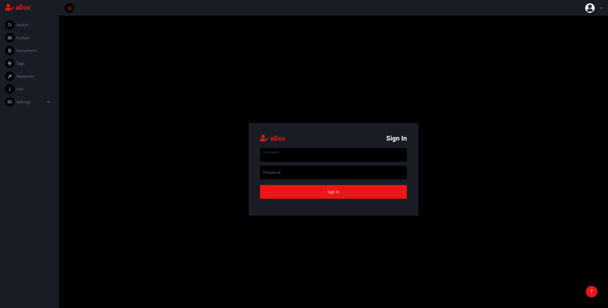
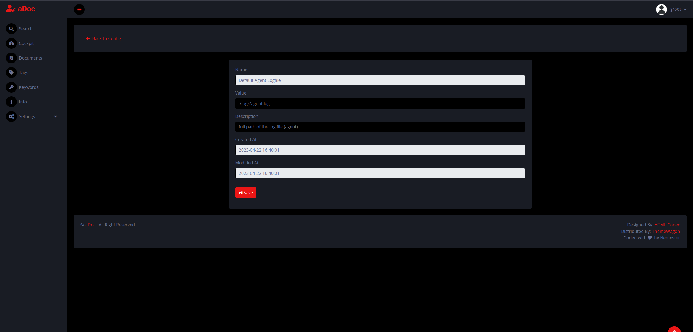
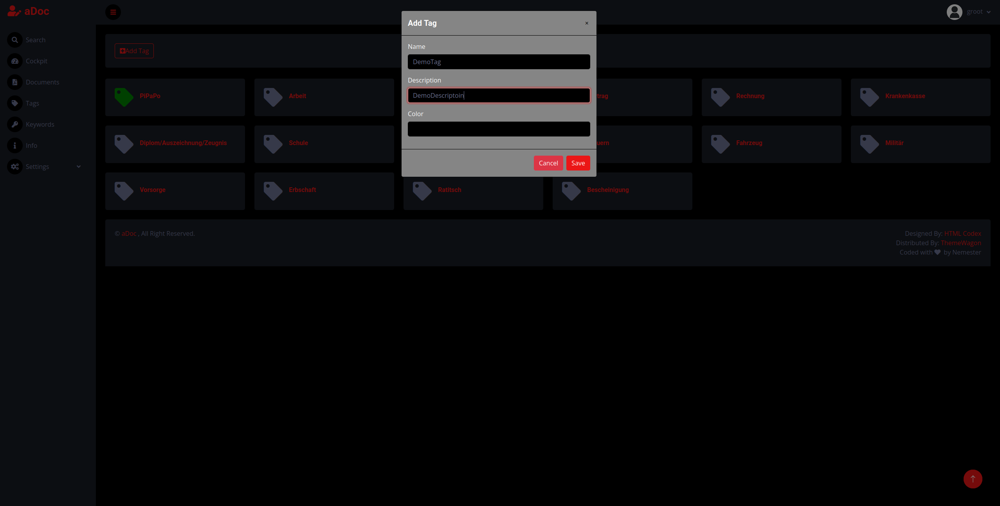
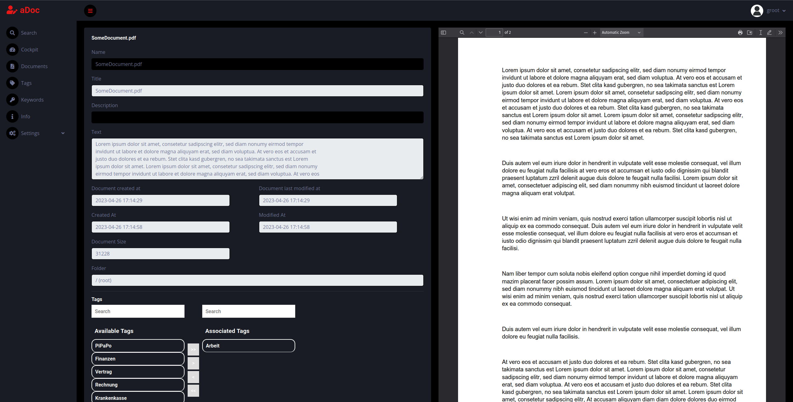
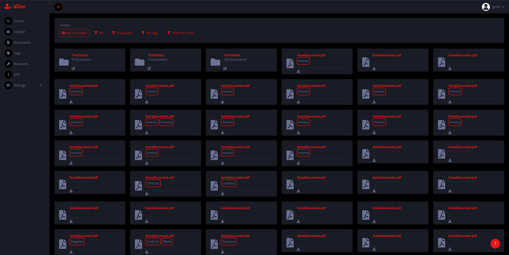

# aDoc

current status: Development (comming soon)

aDoc is a webtool to organize and manage documents (DMS). The documents are tagged automatically based on the defined keywords. You can search the documents via tags or via text (title, content).
___

## Changelog

| Version 	| Date       	| Notes                                                                                                                	|
|---------	|------------	|----------------------------------------------------------------------------------------------------------------------	|
| 0.8.0    	| ??.??.???? 	| Alpha: Will be released here :)                                                                                       |
| 0.7.3    	| 28.02.2023 	| Pre-Alpha 3: UI adaptions and a lot of bugfixes (agent)                                                               |
| 0.7.2    	| 05.02.2022 	| Pre-Alpha 2: Added user and rights                                                                                    | 
| 0.7.1    	| 26.12.2021 	| Pre-Alpha 1                                                                                                           |
| 0.1.0    	| 15.08.2021 	| First version that worked for some part                                                                               |
| 0.0.1   	| 02.03.2021 	| First draft                                                                                                          	|

___

## Technologies and Frameworks

- NodeJS
- Python
- SQLite/PostgreSQL
- Handlebars
- HTML / CSS / JS

## Architecture

___

## Notes
- Database: I've tested aDoc only with SQLite, usage of another RDBMS at own risk
- Scaling: aDoc should remain performant even with a big number of documents (I've tested it with around 2000 documents)
- OS: aDoc was build and tested on Ubuntu 20.04 / Garuda

## Workflow

## Screenshots
### Login

### Config edit

### Add Tag

### Document detail

### Document overview

___

### Credits
Design by [HTML Codex](https://htmlcodex.com) (Theme [DarkPan](https://htmlcodex.com/bootstrap-5-admin-template/))